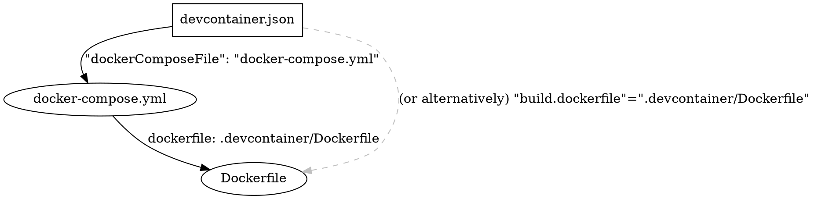

[TOC]
## Basic knowledge

A **host** is an operating system (which usually refers to Linux); a host can be a real machine or a virtual machine.
A **container** (or a service) works like a virtual machine; it is always virtual.
**Docker** is an application managing containers in the host machine.

> 📖In brief, the host machine is where the Docker runs. Hence, under the Docker-container scope, we never set up the environment of the host machine, or modify the storage space (paths and directories) without Docker.

## Docker working with VS Code
First, go to `".devcontainer/devcontainer.json"`:


- `devcontainer.json` is for establishing a consistent vscode environment across devices while working with the container; this configuration file is a feature provided by VS Code.
- `devcontainer.json` can control how to build and run a container
- `devcontainer.json` also synchronizes the settings for addons `Remote - Containers` and `Remote Development` of VS Code across devices while working with a container

> 💡**Hints & Tips**
> - When editing `devcontainer.json` with VS Code, you can hover over each property, such as `name`, `workspaceFolder`, etc., to check the brief description.

### How this container is built
Under the folder `".devcontainer"`:



### Brief note for `devcontainer.json`
`devcontainer.json` defines how to access (or create) a development container. It does the followings: 

Synchronizing Settings and Extensions of VS Code:
- `"extensions"`: let everyone's vscode have the same addons
- `"settings"`: keep everyone's vscode settings identical
- It does not sync your local VS Code extension; the Settings and Extensions managed by `devcontainer.json` will only available while the container is opened.

Run commands every time when you run/start a container
- use `"runArgs"`
- it **overwrites** the commands of `CMD` (in `".devcontainer/Dockerfile"`)
- the commands in `devcontainer.json` **will be overwritten by** those in `".devcontainer/docker-compose.yml"`

See [devcontainer.json reference](https://code.visualstudio.com/docs/remote/devcontainerjson-reference)

### Running a container
There are two approaches to run a container.

#### Method 1: Using Docker Compose
Using `dockerComposeFile` in `devcontainer.json` for configuring how to "run" or "open" container(s). Yes, in this way, multiple containers for different services can works together (between each they are connected with virtual local network).

> 💡**Hints & Tips**
> - The Compose file is a YAML file (e.g., `docker-compose.yml`) defining services, networks, and volumes for a Docker application.
> - When editing `docker-compose.yml` with VS Code, you can hover over each property, such as `services`, `volumes`, etc., to check the brief description.


Add the following setting entries in `".devcontainer/devcontainer.json"`
- `"dockerComposeFile": "docker-compose.yml"`: which means, the container is built and run according to `".devcontainer/docker-compose.yml"`
- `"service": "dev"`: the container(s) `to run; in this example, the container named "dev" is going to be built and run
- `"shutdownAction": "stopCompose"`

In `".devcontainer/docker-compose.yml"`:

- `args`: Define variables that will be used while building the container; for example, all `$VARIANT` (or `${VARIANT}`) in `".devcontainer/Dockerfile"` will be substituted by `"1.6.5"` when executing to code.
- `command`: the commands to run in container "dev" **every time** this container is opened
- `volumes`: Binding **Host directory** (left) with the **directory in the container** (right); in which, you can specify the real path in the host machine or use a named volume.

##### More about `args`
- ⚠️ Variable definitions under `args` overwrite the definition in `".devcontainer/Dockerfile"` **WHEN** 
    - `"dockerComposeFile": "docker-compose.yml"` is specified in `".devcontainer/devcontainer.json"`, **and** 
    - `dockerfile: .devcontainer/Dockerfile` is specified in `".devcontainer/docker-compose.yml"`.
- In this case, a variable `VARIANT` should always be declared in `".devcontainer/Dockerfile"` no matter whether it is defined in `".devcontainer/docker-compose.yml"` or not.

##### More about `volumes` and named volume
- Defining a named volume defines a special space managed by Docker in the host machine.
- All of these special spaces (named volumes) is under a directory of the host machine, for example, `"var/lib/docker/..."`
- ⚠️ Every time you bind a container directory to a named volume, that named volume has to be defined at the same level of `services`. For example: 
    ```
    services:
        dev:
            ...
            volumes:
                myvol1:/home/foo/bar
                myvol2:/home/foo/bla
    volumes:
        myvol1:
        myvol2:
    ```
- **Why binding?** If a path in container is not bound to a volume in the host machine, when the container shuts down all changes are lost.
- You can also check these volumes in the Docker app:
  
- the container's binding volumes won't be synced with git push/pull since they are not in the same directory as `.git`; by the way, `git push`/`git pull`... are done by the container machine.


##### Every container should have an `image`

You can have multiple containers, in which the `image` is a must. For example in `".devcontainer/docker-compose.yml"`:

```
services:
    mycontainer1:
        image: foo-bla-bla
        ...
    mycontainer2:
        image: bar-bla-bla
        ...
```

You can refer to the [docker-example/.../docker-compose.yml](https://github.com/okatsn/docker-example/blob/master/computing-environments/docker-compose.yml). This script is for managing virtual machines (as containers) in a real Linux workstation. You can define the `ports` and `secrets` (which manages usernames and passwords) for each container to allow accessing individual machine's space through internet protocol.
> For example, you can have the julia code in machine A, accessing machine B's virtual disk using the path `"https//......port:8888/home/userA/foobar/data"`.

##### More about `command`
The commands assigned under a specific container (service) is going to be executed in the container, **NOT** the host machine. Take this example:
```
services:
    dev:
        ...
        commands: sh -c "inv env.julia-daemon"
```
Every time the container named "dev" is opened, the function `julia-daemon` in python script `"tasks/env.py"` is `inv`oked; this is done in the machine "dev" where julia and python are already installed when "dev" is built according to `".devcontainer/Dockerfile"`. 
> By default, Invoke searches tasks (scripts) in the directory named `"tasks"` or `"tasks.py"`. See the documentation of Invoke.
> 
> **Requirement**:
> - `RUN mamba install ... invoke=1.6` in Dockerfile
> - define `ns.add_collection(env)` in module `"tasks/__init__.py"` to allow functions in `"tasks/env.py"` to be called


##### Note
- See [Avoid closing container when using VS Code devcontainer](https://code.visualstudio.com/docs/remote/create-dev-container#:~:text=To%20avoid%20having,1000%3B%20do%20%3A%3B%20done%22).

#### Method 2
Without `".devcontainer/docker-compose.yml"`, you surely can manage how to run and build a container solely with `".devcontainer/devcontainer.json"` (by adding `image: "Dockerfile"` which also calls `".devcontainer/Dockerfile"` for building a container).
However, in this way you can have only one service (container); multiple containers are not allowed.
See [devcontainer.json reference](https://code.visualstudio.com/docs/remote/devcontainerjson-reference)


### Dockerfile
A `Dockerfile` is a text document that contains all the commands a user could call on the command line to assemble an image. So the process of writing a `Dockerfile` is similar to the process of building an environment by command.

> 💡**Hints & Tips**
> When editing `Dockerfile` with VS Code, you can hover over each property, such as `FROM`, `RUN`, etc., to check the brief description.

#### Instructions in Dockerfile
Instructions (`FROM`, `RUN`, `ARG`,...) are used in Dockerfile to instruct Docker how to build a container image.

In `".devcontainer/Dockerfile"`, conventionally your image may built `FROM` a base image, switch to the `USER` that has the highest permission, and `RUN` some bash commands to customize your environment. 
During which you may define some local `ARG`ument for convenience or you may have to predefine some `ENV`ironment arguments for your container machine.
In final, you may need to inform Docker that the container `EXPOSE` to some network ports to prevent potential conflicts.

Here are some examples:

`FROM jupyter/minimal-notebook:python-3.9.7`
- it instruct Docker to build your image from "minimal-notebook" which was created by the organization "jupyter"
- "python-3.9.7" is just the version tag (name) of the series of "minimal-notebook"

`USER root`
- switch the Ubuntu user to the highest permissions

`RUN apt-get ...`
- run command `apt-get`, which is the package manager of Ubuntu for install/update some applications

`ARG PROJECT_DIR=/home/jovyan/julia-project`
- define an argument (variable) `PROJECT_DIR` that will be used in this script

`WORKDIR $PROJECT_DIR`
- change the current working directory to `$PROJECT_DIR`; this is similar to `mkdir -p blabla && cd blabla` in the terminal (e.g., w/ bash) of the container's machine.
- `$PROJECT_DIR` will be overwritten if the argument of the same name is defined in `"docker-compose.yml"` (e.g., `services: dev: args: PROJECT_DIR: /home/jovyan/swc-forecast-insider`) when building using `dockerComposeFile`.
- you can use this instruction to set the default working directory of the container


`ENV JULIA_PROJECT=@.`
- define environment argument for the machine
- Please refer julia's official documentation to see why defining `JULIA_PROJECT` to be `@.` is necessary if you have install julia in Linux.
- You can see all the environment arguments (whether they are defined by you or not) in Docker App:
  

`USER $NB_USER` or `USER ${NB_USER}`
- switch back to the ordinary user since we don't needs permission of system level anymore.
- `NB_USER` here is the environment variable of Ubuntu defined in `jupyter/minimal-notebook`


`EXPOSE 1234`
- inform Docker that port 1234 may be used (by julia's Pluto)

#### Note
- You will make heavy use of the system-wide [package manager](https://en.wikipedia.org/wiki/Package_manager) command line tools. The following table lists the CLIs used by different operating systems.
    |OS|CLI|
    |:---|:---:|
    |Ubuntu/Debian |[apt](https://en.wikipedia.org/wiki/APT_(software))<br>(low level command: `apt-get`, `apt-config`, `apt-cache`, etc.)|
    |Fedora/CentOS/RHEL(aws ec2)|[yum](https://en.wikipedia.org/wiki/Yum_(software))|
    |Arch Linux|[pacman](https://en.wikipedia.org/wiki/Arch_Linux#Pacman)|
    |Windows10/11|[winget](https://docs.microsoft.com/zh-tw/windows/package-manager/winget/)|

- CLI infers command line interface; what you type in terminal (e.g., with bash) are mostly command line tools.
- package manager manipulates the applications (e.g., install, update, remove, version lock, etc.) in your OS.


### VS Code extension
- Docker (ms-azuretools.vscode-docker)
- Remote Development (ms-vscode-remote.vscode-remote-extensionpack)

## Brief Summary
### General Tips
- Use the `extensions` and `settings` properties to set the VS Code environment in the container.
- The image you want to use to create a development container can be pulled from the container registry or built from a Dockerfile.
- If a single container environment is not suitable for your use case, you can use `docker-compose.yml` to configure a multi-container environment (of course you can also use `docker-compose.yml` to configure a single container environment). [As of April 2022, `Remote - Containers` VS Code extension only supports running multiple containers with Docker Compose.](https://code.visualstudio.com/docs/remote/create-dev-container#:~:text=Fortunately%2C%20Remote%20%2D%20Containers%20supports%20Docker%20Compose%20managed%20multi%2Dcontainer%20configurations.) (If the markdown renderer cannot open the correct link, just use the URL directly)
- There are three approaches to execute commands every time a container is opened: 
    1. use `"runArgs"` in `".devcontainer/devcontainer.json"`; it supports [Docker CLI arguments (docker run)](https://docs.docker.com/engine/reference/commandline/run/) arguments.
    2. use `CMD` in the **last line** of `".devcontainer/Dockerfile"`; all precedently appeared `CMD` will be ignored (including those `FROM` a basis image)
    3. add `command` in `".devcontainer/docker-compose.yml"`
- For best practice, **all** commands is expected to be executed by the container machine.


## References
- [VS Code: Create a development container](https://code.visualstudio.com/docs/remote/create-dev-container#_use-a-dockerfile)
- [VS Code: devcontainer.json reference](https://code.visualstudio.com/docs/remote/devcontainerjson-reference)
- [VS Code: Advanced container configuration](https://code.visualstudio.com/remote/advancedcontainers/overview)
- [Docker: Dockerfile reference](https://docs.docker.com/engine/reference/builder/)
- [Docker: Compose file version 3 reference](https://docs.docker.com/compose/compose-file/compose-file-v3/)


# Linux
See 
- 鳥哥的 Linux 私房菜
- 鳥哥的 Linux 私房菜 > 使用者權限(這是關鍵)
