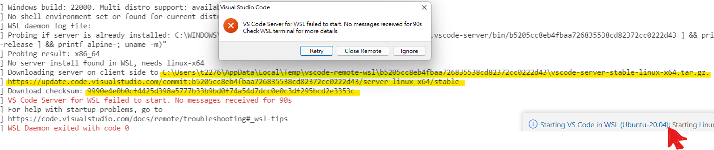
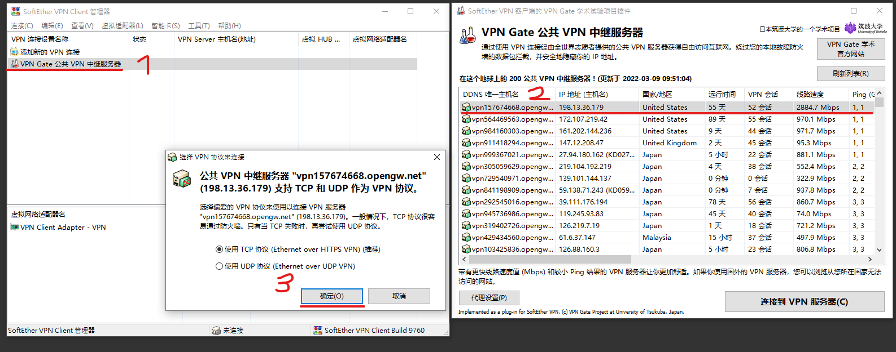
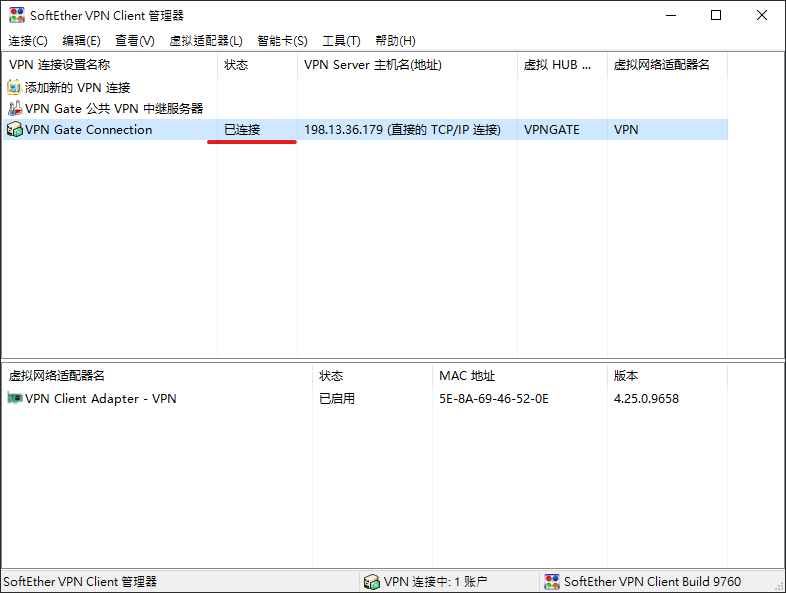
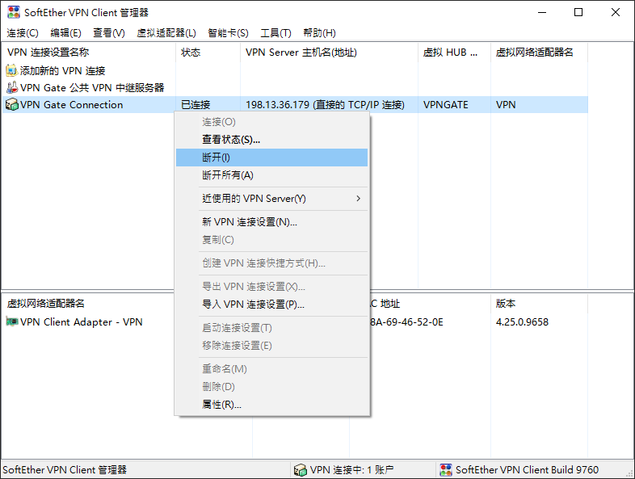
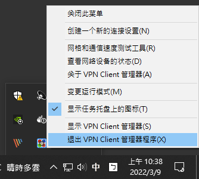

<!-- @import "[TOC]" {cmd="toc" depthFrom=1 depthTo=6 orderedList=false} -->

<!-- code_chunk_output -->

- [Install or set up prerequisite](#install-or-set-up-prerequisite)
  - [Windows Terminal (Windows User)](#windows-terminal-windows-user)
  - [WSL (Windows User)](#wsl-windows-user)
  - [Git](#git)
    - [Windows](#windows)
    - [Ubuntu](#ubuntu)
  - [Docker and Docker Compose](#docker-and-docker-compose)
    - [Windows](#windows-1)
    - [Ubuntu](#ubuntu-1)
  - [VS Code](#vs-code)
- [Setup development environment](#setup-development-environment)
  - [Windows](#windows-2)
  - [Ubuntu](#ubuntu-2)
- [Open container in VS Code](#open-container-in-vs-code)
- [Check out a branch for your work](#check-out-a-branch-for-your-work)
- [Code style guide](#code-style-guide)
- [Workflow tips](#workflow-tips)
- [Commit your changes](#commit-your-changes)
- [Run test cases](#run-test-cases)
- [Run test coverage](#run-test-coverage)
- [Reformat source code](#reformat-source-code)
- [Push your work to GitHub and wait to be merged 🎉](#push-your-work-to-github-and-wait-to-be-merged)
- [TODO](#todo)
- [Trouble shooting](#trouble-shooting)
  - [Trouble in starting WSL remote](#trouble-in-starting-wsl-remote)
- [References](#references)

<!-- /code_chunk_output -->


## Install or set up prerequisite
1. Git
1. Docker and Docker Compose
1. VS Code

If you are a **Windows** user, please install additional tools **first**.
1. Windows Terminal
1. Windows Subsystem for Linux (WSL)

See the following subsections **in order** to install or set up the necessary tools.

> ⚠️ Note that we use docker to run containers, and **containers running on Windows 10 cannot access native GPU resources (more specifically NVIDIA CUDA)** under normal circumstances.

### Windows Terminal (Windows User)
You can download Windows Terminal from [here](https://www.microsoft.com/zh-tw/p/windows-terminal/9n0dx20hk701?activetab=pivot:overviewtab) to get a better terminal experience.

### WSL (Windows User)
> ⚠️
> - You must be running Windows 10 version 2004 and higher (Build 19041 and higher) or Windows 11.
> - If you're running an older build, or just prefer not to use the install command and would like step-by-step directions, see [WSL manual installation steps for older versions](https://docs.microsoft.com/en-us/windows/wsl/install-manual).

1. Open the **Windows Terminal**. Then, install **WSL2** and the Ubuntu-20.04 distribution as default with the following command.
    ```powershell
    wsl --install -d Ubuntu-20.04
    wsl --set-default Ubuntu-20.04
    ```
1. Check if your Ubuntu-20.04 distribution uses **WSL 2**.
    ```powershell
    wsl -l -v
    ```
    If your Ubuntu-20.04 distribution uses WSL 1, please use the following command to set your Ubuntu-20.04 distribution to use WSL 2.
    ```powershell
    wsl --set-version Ubuntu-20.04 2
    ```
1. If you want to browse files in wsl in the Windows GUI, open "File Explorer" and type **\\\\wsl$** in the address bar and press "Enter". This allows you to view all wsl distributions in File Explorer and freely browse files of different wsl distributions.

### Git
We will use Git installed in the container for version control. VS Code will detect the git configuration file in the host and bring the basic configuration to the container (thanks to VS Code 🙌), so please follow the instructions below to set it up
#### Windows
1. Open the **Windows Terminal** and start the Ubuntu-20.04 shell.
    ```powershell
    wsl
    ```
1. Set global configuration file (~/.gitconfig).
    > ℹ️ You should change the YOUR_USERNAME and YOUR_EMAIL to your own.
    ```bash
    git config --global user.name "YOUR_USERNAME"
    git config --global user.email "YOUR_EMAIL"
    ```

#### Ubuntu
I think you can set up basic ~/.gitconfig file smoothly. 😃

### Docker and Docker Compose
> ℹ️ You should know the terminology of container technology.
> - **Docker**: A program that implements container technology.
> - **Container**: Similar to virtual environments. Your application will run inside the container.
> - **Image**: Think of it as a snapshot of the container. Can quickly generate containers from images.

#### Windows
1. Download **Docker desktop for Windows** from [official website](https://hub.docker.com/editions/community/docker-ce-desktop-windows) and install it.
1. Start Docker Desktop, and select **Settings (gear icon in the upper right corner) > General** to check whether the **Use WSL 2 based engine** check box is selected. If it is not checked, please select it.

#### Ubuntu
I think you can install docker and docker compose smoothly by yourself. 😃

### VS Code
1. Download VS Code from the [official website](https://code.visualstudio.com/) and install it.
1. Install VS Code extension called **Remote Development** from [here](https://marketplace.visualstudio.com/items?itemName=ms-vscode-remote.vscode-remote-extensionpack).


## Setup development environment
> ⚠️
> - This is an instruction to establish a development environment, not a deployment environment.
> - Make sure docker is running in the background.

### Windows
1. Start **VS Code**.
1. Press `F1` or `ctrl+shift+p` to open Command Palette (interactive prompt will appear in the top center)
1. Type **Remote-WSL: New WSL Window** to search for command (search function is not case sensitive).
1. Use the keyboard up and down keys to select the **Remote-WSL: New WSL Window** command and press "Enter" (the selected command will be highlighted) or use the mouse to click the **Remote-WSL: New WSL Window** command.
1. Switch to the new window connected to WSL. Check for the **WSL: Ubuntu-20.04** prompt on the left side of the status bar (at the bottom of the window).
1. Click **Source Control** tab in the left side bar.
1. Click the **Clone Repository** to clone this repo.
1. Paste the **https://github.com/ML-SWC/swc-forecast-insider.git** into the interactive prompt at the top center of the window and press "Enter".
1. In the interactive prompt at the top center of the window, select the **preferred path to store the cloned repository** and press "Enter".
1. After the clone is successful, a notification will appear in the lower right corner to remind you to open the cloned repository. Please click **"Open"**.
1. After successfully opening the project in WSL, a notification will be displayed in the lower right corner to remind you that you can use the container. Click **"Reopen in Container"** to building the image and run the container.
1. When image and container are successfully built, press **``ctrl+shift+` ``** in VS Code to open integrated terminal. Install development dependencies and setup pre-commit hooks with the following command.
    ```bash
    inv env.init-dev
    ```
1. Your development environment has been well established. You can leave VS Code or go to next section.

### Ubuntu
1. Start **VS Code**.
1. Click **Source Control** tab in the left side bar.
1. Click the **Clone Repository** to clone this repo.
1. Paste the **https://github.com/ML-SWC/swc-forecast-insider.git** into the interactive prompt at the top center of the window and press "Enter".
1. In the interactive prompt at the top center of the window, select the **preferred path to store the cloned repository** and press "Enter".
1. After the clone is successful, a notification will appear in the lower right corner to remind you to open the cloned repository. Please click **"Open"**.
1. After successfully opening the project, a notification will be displayed in the lower right corner to remind you that you can use the container. Click **"Reopen in Container"** to building the image and run the container.
1. When image and container are successfully built, press **``ctrl+shift+` ``** in VS Code to open integrated terminal. Install development dependencies and setup pre-commit hooks with the following command.
    ```bash
    inv env.init-dev
    ```
1. Your development environment has been well established. You can leave VS Code or go to next section.


## Open container in VS Code
> ⚠️
> - Make sure docker is running in the background.
> - Ensure that the development environment is set up correctly.
> - If your container is gone, open the folder in VS Code(note for Windows user: VS Code should open in WSL) and press `F1` or `ctrl+shift+p` to use **Remote-Containers: Reopen in Container** command.
> - If devcontainer has changed, open the folder in VS Code(note for Windows user: VS Code should open in WSL) and press `F1` or `ctrl+shift+p` to use **Remote-Containers: Rebuild and Reopen in Container**.

1. Start **VS Code**.
1. Click **Remote Explorer** tab in the left side bar.
1. Select **Containers** in the drop-down menu to display the available Dev Containers.
1. Click the **Open Folder in Container icon** on the right side of the swc-forecast-insider label.
1. The VS Code will reopen the window that connect the container (check if there is a prompt for **Dev Container: swc-forecast-insider** in the lower left corner of the window).


## Check out a branch for your work

> ⚠️
> - Do not work on the main branch unless necessary.
> - branch names should be in lowercase and separated by "-". For example `feature-clean-data`, `bug-db-remove-func`, `issue-01`.

1. Check the git branch button on the left side of the status bar (bottom of the window) (hovering over the button shows "swc-forecast-insider (Git) - Checkout branch/tag...") to know the current branch.
1. If the **current branch is not the branch you want to work on**, click the git branch button on the left side of the status bar. Interactive prompts will appear at the top center of the window.
1. From the options in the interactive prompt, you can create a new branch, create a new branch from a specific branch, or switch to a specific branch.

## Code style guide
Follow the [Blue](https://github.com/invenia/BlueStyle) style guide.

JuliaFormatter.jl will only handle code formatting according to certain style conventions. So please read the Blue style guide to handle the parts that JuliaFormatter.jl can't handle.


## Workflow tips
Keeping the julia REPL open for a long time and developing your julia code in the REPL can effectively utilize the compiled code and avoids the delay caused by restarting the julia process. See [Julia Workflow Tips](https://docs.julialang.org/en/v1/manual/workflow-tips/) for more information.

After development is complete, it's a good idea to run your work in a new julia REPL/process to prevent variables in long-term open julia REPL workspaces from affecting your results. Also note that the results of using `include("work.jl")` in the **julia REPL** may differ from the results of running `julia work.jl` directly.

Since ML projects require frequent modification of data or experiments, it may be convenient to write a CLI (command line interface) that can input arguments/flags to scripts when using tools that help record modification history, but plan your CLI carefully. (See [Reproduce.jl](https://github.com/mkschleg/Reproduce.jl) for more information on experiment management. See [DVC](https://dvc.org/) for more information on data versioning.)


## Commit your changes
> ℹ️ Please try to follow the [Conventional Commits](https://www.conventionalcommits.org/en/v1.0.0/), but this machine learning project is not a package development project after all, so it can have some flexibility.

1. Click **Source Control** tab in the left side bar.
1. In the "Changes" expandable list, click the ➕ icon to stage file/folder changes.
1. If you click by mistake, click the ➖ icon in the "Staged Changes" expandable list to unstage file/folder changes.
1. If all the items in the "Staged Changes" expandable list are indeed items you want to add to git history, use the following template in the text input box (with hint text "Message (Ctrl+Enter commit on \<branch>)") to edit your commit message.
    ```text
    <type>[optional scope]: <description>

    [optional body]

    [optional footer(s)]
    ```
    For example, you can write a message like
    ```text
    feat(data): function for interpolating time series

    Add function to interpolate time series with missing
    or unreliable values.

    BREAKING CHANGE: introduce new dependencies
    ```
    or
    ```text
    style: reformat code
    ```
1. After editing the commit information, remember to press `Ctrl+Enter` in the text input box or click the ✔️ icon to commit on your working branch.


## Run test cases
> ℹ️ If you edit the code stored in `src` or `test` directory, remember to run test.

1. Press **``ctrl+shift+` ``** in VS Code to open integrated terminal.
1. Make sure the current working directory is **swc-forecast-insider**
1. Make sure all test cases pass.
    ```bash
    inv test
    ```


## Run test coverage
> ℹ️ If you edit the code stored in `src` or `test` directory, remember to run test coverage.

1. Press **``ctrl+shift+` ``** in VS Code to open integrated terminal.
1. Make sure the current working directory is **swc-forecast-insider**
1. Check the test coverage and see where you can add test cases.
    ```bash
    inv test.cov
    ```


## Reformat source code
> ℹ️ If you edit the code outside the container, remember to format the code.

1. Press **``ctrl+shift+` ``** in VS Code to open integrated terminal.
1. Make sure the current working directory is **swc-forecast-insider**
1. Format your code through `JuliaFormatter.jl`.
    ```bash
    inv style.reformat
    ```


## Push your work to GitHub and wait to be merged 🎉
1. Click **Source Control** tab in the left side bar.
1. Click **⋯** icon (to the right of the "SOURCE CONTROL" expandable list) to view more actions.
1. Click **Push** to push your work to GitHub.
1. If you think your changes are ready to be merged into the main branch, you can make a "PR (Pull Request, is an operation on github)" and notify main reviewer (or everybody) to check.
1. If your branch is merged into main, you can delete your working branch or continue working on your branch (remember to merge main into working branch).


## todo
- [DVC](https://dvc.org/) is used later to reduce development complexity at the beginning of the project
<!--
## Pulling data from remote storage via DVC (Data Version Control)
1. Press **``ctrl+shift+` ``** in VS Code to open integrated terminal.
1. Show status of a local cache compared to a default remote storage. [More info](https://dvc.org/doc/command-reference/status)
    ```bash
    dvc status -c
    ```
1. Download tracked files or directories from remote storage based on the current dvc.yaml and .dvc files, and make them visible in the workspace. [More info](https://dvc.org/doc/command-reference/pull)
    ```bash
    dvc pull
    ```

## Handling new data or changed tracking data via DVC
1. Press **``ctrl+shift+` ``** in VS Code to open integrated terminal.
1. Track data files or directories with DVC, by creating a corresponding .dvc file. [More info](https://dvc.org/doc/command-reference/add)
    ```bash
    dvc add <targets>
    ```
    For example, tracking a directory with DVC
    ```bash
    dvc add dirtotrack
    ```
    or tracking files
    ```bash
    dvc add model/random_forest.jld2 model/decision_tree.jld2
    ```
1. Record changes to files or directories tracked by DVC by storing the current versions in the cache. [More info](https://dvc.org/doc/command-reference/commit)
    ```bash
    dvc commit
    ```

## Build pipelines
If you need to build pipelines, the DVC workflow is preferred so we can keep track of the pipeline, its dependencies and outputs.See the [DVC documentation](https://dvc.org/doc/start/data-pipelines) for more information.
-->


## Trouble shooting
### Trouble in starting WSL remote
When you failed in starting the dev container, check if there is a connection error at the stage of opening WSL-remote (**Remote-WSL: Open new window**):


If this is the case, the failure that you cannot start a WSL remote server as well as the dev container is caused by the proxy of your company or organization. See [this thread](https://github.com/microsoft/vscode-remote-release/issues/133#issuecomment-489627195).

#### Download VS Code server manually to solve the issue
- Download **vscode-server-linux-x64.tar.gz** via an alternative network (e.g. your cell phone)
    - Check the log in WSL terminal to find the link. For example, https://update.code.visualstudio.com/commit:b5205cc8eb4fbaa726835538cd82372cc0222d43/server-linux-x64/stable
    > 💡**Hint**: See the highlighted area in the snapshot above; click on where the red arrow points to open the log.
- Copy **vscode-server-linux-x64.tar.gz** to the following place:
    - ```
      C:\Users\<username>\AppData\Local\Temp\vsch\serverCache\b5205cc8eb4fbaa726835538cd82372cc0222d43\
      ```
    > 💡**Hint**: See the highlighted area in the snapshot above to find the *commit checksum*.

#### Use VPN to solve the issue
- Download and install this [VPN](https://www.vpngate.net/cn/download.aspx). (Please assess the risks of using this VPN yourself)
- Double click the "VPN Gate 公共 VPN 中繼服務器". (corresponding to step 1 in the figure below)
- Select a VPN server and double click. (corresponding to step 2 in the figure below)
- Select the default TCP protocol as the preferred one and click "確定". (corresponding to step 3 in the figure below)

- If the connection is successful, you will see the window shown below.

- If your VS Code server has finished downloading, you can left-click "VPN Gate Connection" and click "斷開" to disconnect the VPN server.

- To close the VPN Client program completely, click the arrow in the taskbar to expand Background Tasks, then left-click the VPN Client logo and click "退出 VPN Client 管理器程序".



## References
- [Install WSL](https://docs.microsoft.com/en-us/windows/wsl/install)
- [Install Docker Desktop on Windows](https://docs.docker.com/desktop/windows/install/)
- [Using Docker as a Dev Environment with VS Code: Part 2](https://spin.atomicobject.com/2021/06/16/docker-development-container/)
- [DrWatson.jl Docs](https://juliadynamics.github.io/DrWatson.jl/stable/)
- [Data Version Control With Python and DVC](https://realpython.com/python-data-version-control/)
- [GitHub: terasakisatoshi/jldev_poetry](https://github.com/terasakisatoshi/jldev_poetry)
- [GitHub: cjolowicz/hypermodern-python](https://github.com/cjolowicz/hypermodern-python)
- [GitHub: Lee-W/cookiecutter-python-template](https://github.com/Lee-W/cookiecutter-python-template/tree/0.7.1)
- [GitHub: dgoings/docker-dev-example](https://github.com/dgoings/docker-dev-example)
- [GitHub: drivendata/cookiecutter-data-science](https://github.com/drivendata/cookiecutter-data-science)
- [GitHub: crmne/cookiecutter-modern-datascience](https://github.com/crmne/cookiecutter-modern-datascience)
